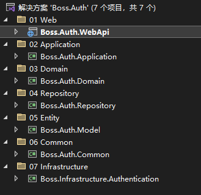
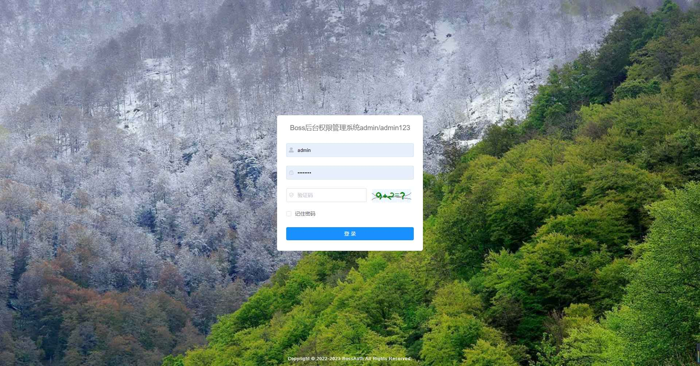
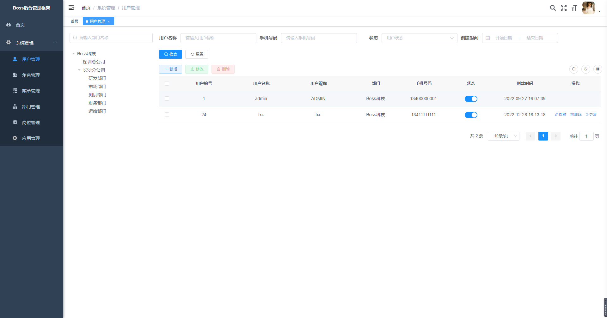
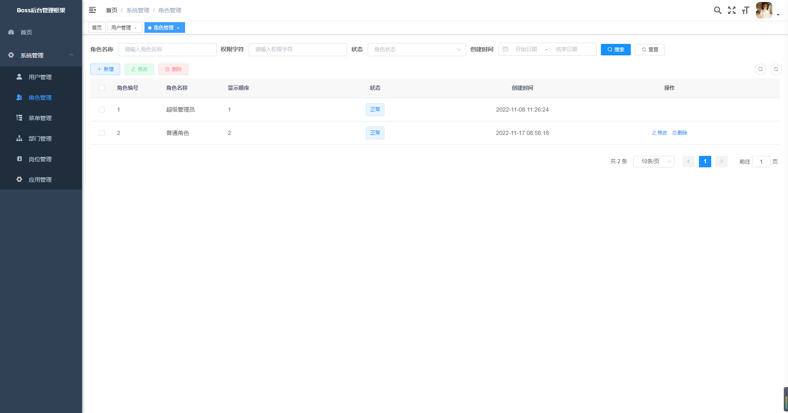
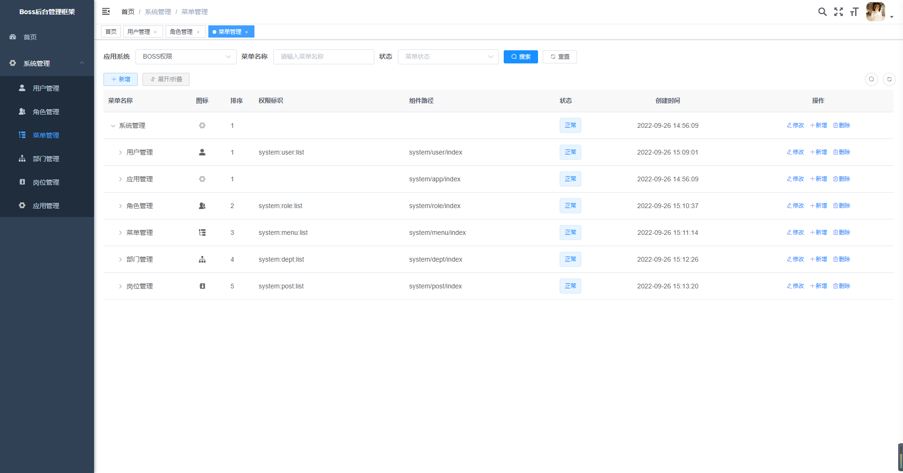
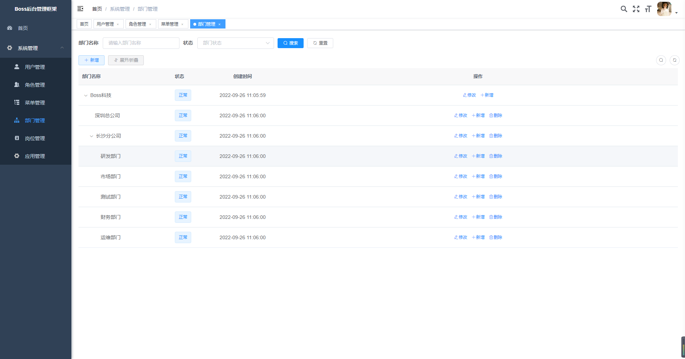
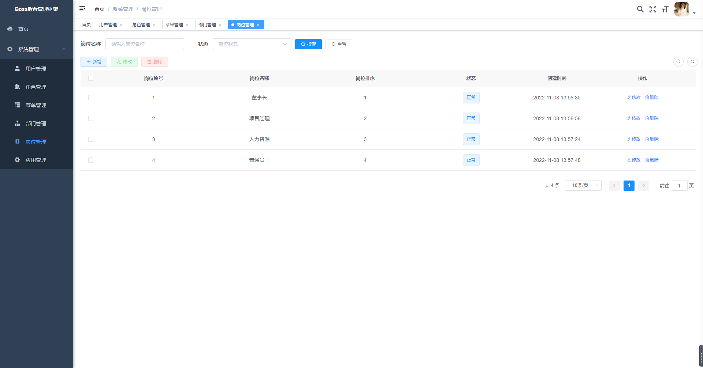
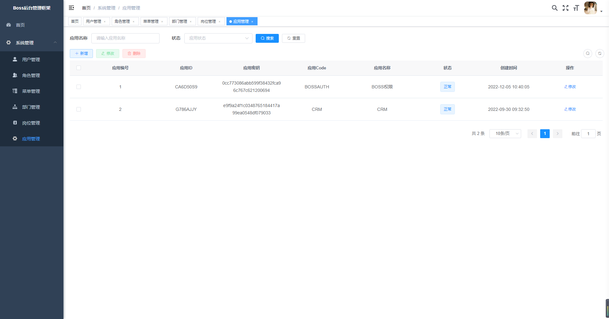

# BossAuth

# 项目简介

这是一个基于.Net Core 6.0 +DDD模式开发的通用权限系统。前端借鉴了诺依的框架，框架选型都是使用了比较最新的技术、前后端分离。

技术架构

1、跨平台：这是基于.Net Core 6.0开发的系统，可以部署在Docker, Windows, Linux, Mac.

2、数据库支持：SQL Server, MySQL,Oracle.

3、前端框架：Vue+Element UI.

4、后端框架：.Net Core 6.0+AutoMapper+Autofac+ SqlSugar + Swagger.

5、认证采用：Jwt

# 项目结构

   

# 后台管理系统

1、登录

2、用户管理：系统用户管理

3、角色管理：角色对应应用菜单权限分配，角色对应权限，用户属于某个角色

4、菜单管理：根据应用配置系统菜单，操作权限，按钮权限标识

5、部门管理：配置系统组织机构（公司、部门、小组）

6、岗位管理：配置系统用户所担任职务

7、应用管理：配置相应系统Code与密钥

# 后台功能截图

登录

用户管理

角色管理

菜单管理

部门管理

岗位管理

应用管理

# Boss通用权限系统交流群

QQ群：461263974
